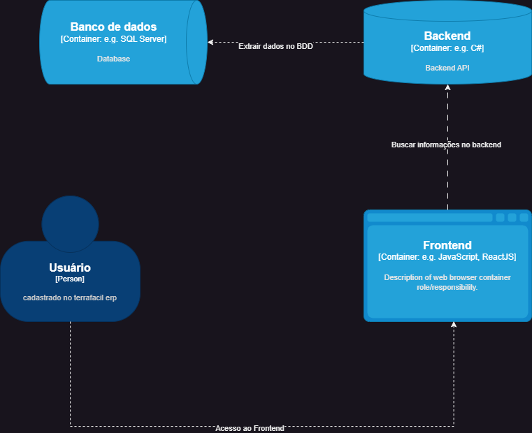

# Diagrama de Contêiner

>O "Frontend" é desenvolvido em React, uma biblioteca JavaScript para construir interfaces de usuário.
O "Backend" é uma API desenvolvida em C#, que lida com a lógica de negócios e processamento de dados.
Essa representação reflete a arquitetura de contêineres do TerraFácil ERP, com a divisão clara entre o frontend e o backend, bem como as tecnologias específicas utilizadas em cada parte do sistema.

